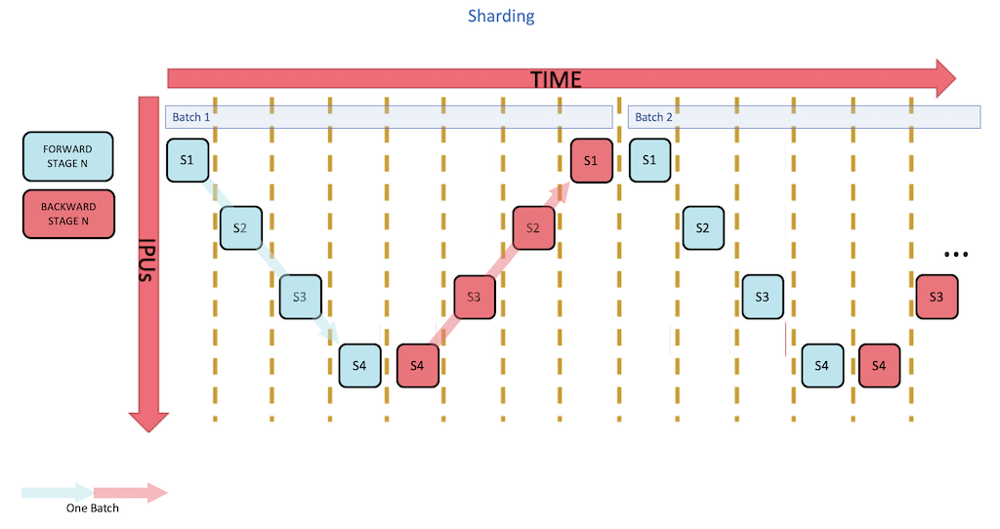
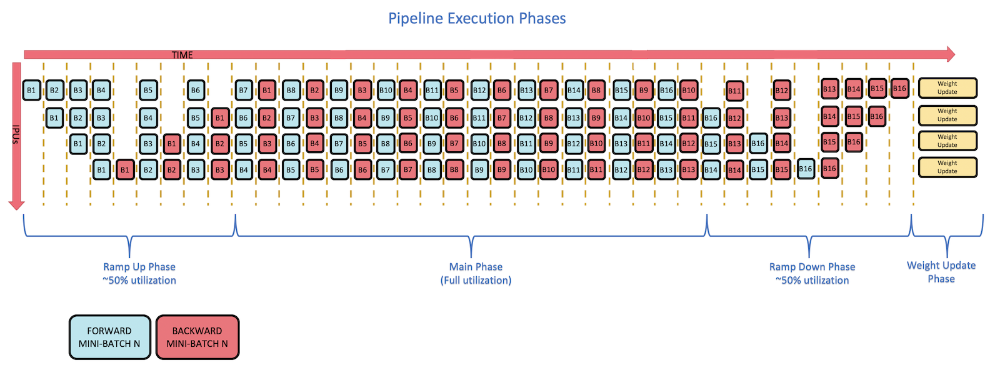
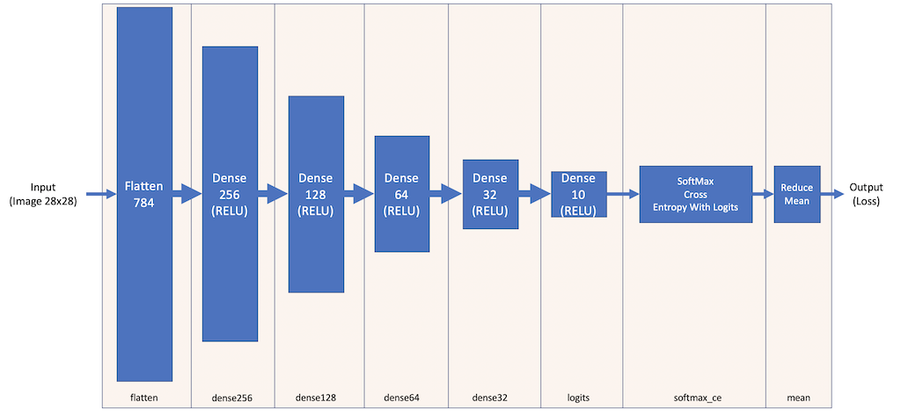
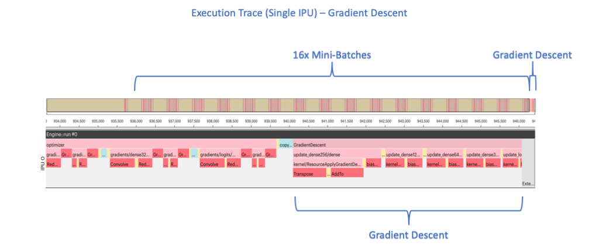
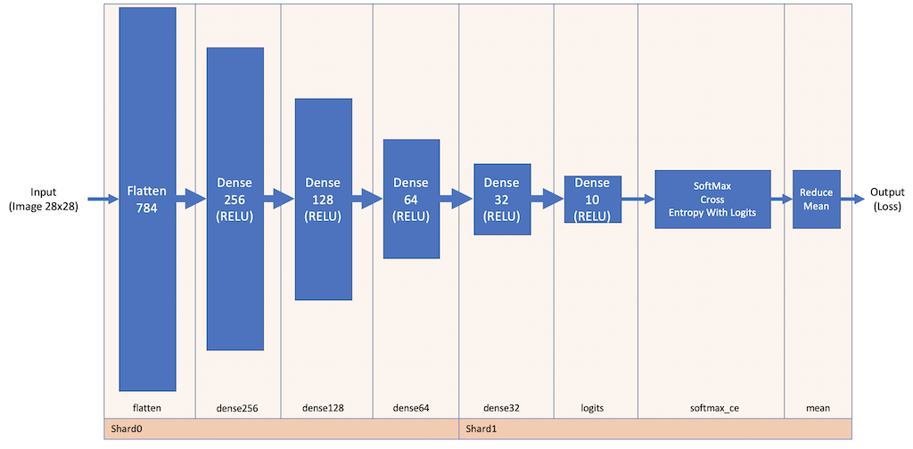
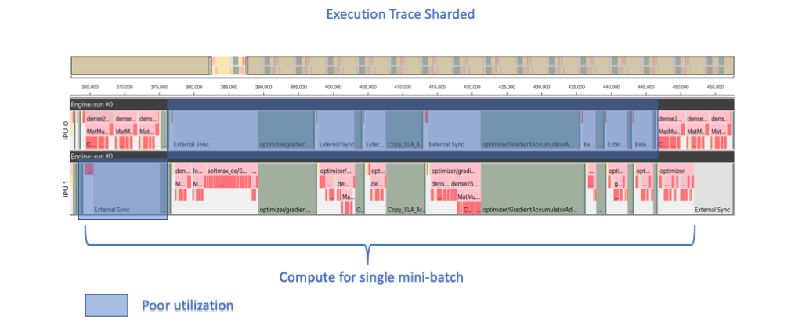
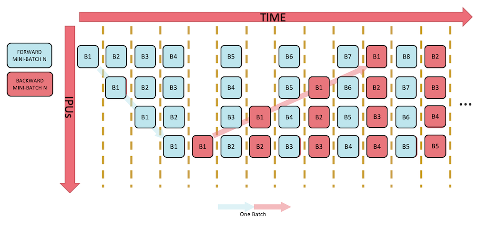
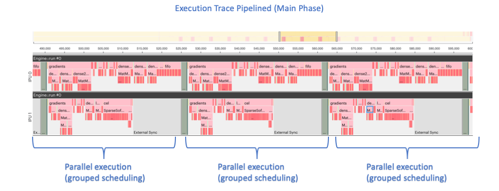

# TensorFlow 1 Pipelining Tutorial

## Introduction
If a model is too big to fit on one IPU, you will need to distribute it over 
multiple IPUs. This is called model parallelism.  
Documentation for model parallelism on IPU with TensorFlow can be found here: 
[TensorFlow Model Parallelism](<https://docs.graphcore.ai/projects/tf-model-parallelism/en/latest/model.html#model-parallelism>)

This tutorial first provides an overview of the key concepts from this document. 
It then provides a walkthrough of how pipelining can be applied to an existing 
TensorFlow application that currently runs on a single IPU.

## Requirements

For software installation and setup details, please see the Getting Started 
guide for your hardware setup, available here: 
[Getting Started Guides](<https://docs.graphcore.ai/en/latest/getting-started.html>).

You must have installed the Graphcore TensorFlow 1 wheel into your current 
active Python environment before starting the tutorial.

## Directory Structure

| Filename                               | Description                                                                                    |
| -------------------------------------- | ---------------------------------------------------------------------------------------------- |
| `README.md`                            | This tutorial in markdown format                                                               |
| `pipelining.ipynb`                     | This tutorial in Jupyter notebook format                                                       |
| `pipelining.py`                        | An executable python file that is used as a single source to generate this file                |
| `step1_single_ipu.py`                  | Step 1 - the existing TensorFlow application that runs **without** pipelining on a single IPU. |
| `answers/step2_sharding.py`            | Step 2 - shows how to run on multiple IPUs, still **without** pipelining.                      |
| `answers/step3_pipelining.py`          | Step 3 - shows how to add pipelining.                                                          |
| `answers/step4_configurable_stages.py` | Step 4 - shows how configurable stages might be implemented.                                   |
| `scripts/profile.sh`                   | Helper script to capture profiling reports.                                                    |
| `images/`                              | Images used in this README.                                                                    |

## Key Principles of Model Pipelining

This section describes the key principles of model pipelining with TensorFlow 
1 on IPU. A later section will apply this to the existing TensorFlow application 
that initially runs on a single IPU.

## Overview

TensorFlow on IPU supports two methods for model parallelism.

### 1. Model Parallelism With Sharding

With model sharding, the model is split into stages where each stage can fit 
and be run on a single IPU. The output of each stage is fed to the input of 
the stage that follows it. Execution of the model is serialised. That is, each 
stage is executed in turn while the IPUs allocated to other stages remain idle.



Refer to the technical note on TensorFlow Model Parallelism for full details: 
[TensorFlow Model Parallelism - Sharding](<https://docs.graphcore.ai/projects/tf-model-parallelism/en/latest/sharding.html#sharding>)

Model sharding provides a method to run larger models that is conceptually 
straightforward and might be useful for initial development or debugging. 
However, it does not offer good utilisation of the allocated IPU resource and, 
for this reason, sharding is not recommended for production models where 
performance is critical.

### 2. Model Parallelism With Pipelining

With pipelining, as with sharding, the model is split into stages where each
stage can fit and be run on a single IPU. However, unlike sharding, the compute
for separate batches is overlapped so that execution of the model is parallelised.
That is, each stage (part of the original model) is executed on its IPU while
the IPUs allocated to previous stages are already working on subsequent batches.
This provides improved utilisation compared to sharding.


Refer to the technical note on TensorFlow Model Parallelism for full details:
[TensorFlow Model Parallelism - Pipelining](<https://docs.graphcore.ai/projects/tf-model-parallelism/en/latest/pipelining.html#pipelining>)

Pipelining provides a method to run larger models that is conceptually less
straightforward compared to sharding. However, it offers better utilisation of
the allocated IPU resource and, for this reason, pipelining is recommended
where performance is critical.

This tutorial focuses on how to apply pipelining in TensorFlow 1.

### Pipeline Execution Phases

It is important to understand the key phases of pipeline execution:

1. Ramp up -  the pipeline is being filled; work is flowing into each stage 
until all stages are filled (all IPUs are busy).
2. Main execution - all stages are filled and IPU utilisation is maximised.
3. Ramp down - the pipeline is being drained; work is flowing out of each stage 
until all stages are empty (no IPUs are busy).
4. Weight updates - all pipeline batches have been processed, so accumulated 
gradients can be processed (gradient descent) and weights updated.

Note:  

* Each individual batch passed through the pipeline is called a **mini-batch**.  
* Weights are updated only once a set of mini-batches has been fully processed.  
* Gradients are accumulated across a set of mini-batches.  
* Weight updates are applied once all the complete set of mini-batches are processed.  

In short, pipelining enforces **gradient accumulation** where:  

`effective batch size` = `mini-batch size` * `gradient accumulation count`  

Performing gradient accumulation is valid because summing the gradients across 
all the examples in a batch immediately and accumulating them over several steps are equivalent.  

Increasing the gradient accumulation count has these benefits:

1. A smaller proportion of time is spent in the ramp up and ramp down - that is, 
more time is spent in the main execution phase where maximum utilisation of the 
IPUs is made.
2. Fewer overall weight updates are made, which saves compute time.

Here is the pipeline outline extended to show the progress of 16 mini-batches 
followed by a weight update. Notice that the best utilization of the IPUs is 
during the main phase and that this is sustained until the last mini-batch enters 
the pipeline, following which the ramp down begins. Also notice that weight 
updates are only applied once, following the ramp down (after the pipeline has 
been drained of all mini-batches.)



## Tutorial Walkthrough

This tutorial starts with a simple multi-stage model that trains on the MNIST dataset.  

Note:  

* Your 'real-world' models are probably more complicated, but the techniques 
learned in this tutorial can still be applied.  
* The results you see locally will depend on which IPU hardware you run on and 
which SDK you are using.  
* Similarly, when looking at profiling reports you have generated yourself, 
they may not look exactly the same as the reports presented in this tutorial.  
* The `scripts/profile.sh` helper script is used to capture profiling reports; 
this will  
  a) override the application parameters to run just a single step without 
  repeat and with constrained batch accumulation,  
  b) enable autoReport to capture all reports,  
  c) enable synthetic data to remove host IO from the execution trace.  

### Tutorial Step 1: The Existing Single IPU Application

The code we will start with can also be found [`step1_single_ipu.py`](step1_single_ipu.py).

Here is a slightly simplified version of it. Take a look at the code and 
familiarise yourself with it. 

We start with importing all necessary libraries


```python
import time
import math
import numpy as np
import tensorflow.compat.v1 as tf
from tensorflow.keras.datasets import mnist
from tensorflow.keras import layers
from tensorflow.python import ipu

tf.disable_eager_execution()
tf.disable_v2_behavior()
```

If you see output something like this below then it means that you forgot to 
install the Graphcore TensorFlow 1 wheel. See [the Requirements section](#requirements).

```
Traceback (most recent call last):
  File "step1_single_ipu.py", line 6, in <module>
    import tensorflow.compat.v1 as tf
ModuleNotFoundError: No module named 'tensorflow'
```

Set hyperparameters, if you want to run the script with different ones remember
to rerun all cells below


```python
BATCH_SIZE = 32
REPEAT_COUNT = 160  # The number of times the pipeline will be executed for each step.
EPOCHS = 50
LEARNING_RATE = 0.01
BATCHES_TO_ACCUMULATE = 16  # How many batches to process before processing gradients and updating weights.
```

Create a function responsible for generating a dataset


```python
def create_dataset(batch_size):
    train_data, _ = mnist.load_data()

    def normalise(x, y):
        return x.astype("float32") / 255.0, y.astype("int32")

    x_train, y_train = normalise(*train_data)

    def generator():
        return zip(x_train, y_train)

    types = (x_train.dtype, y_train.dtype)
    shapes = (x_train.shape[1:], y_train.shape[1:])

    num_examples = len(x_train)
    dataset = tf.data.Dataset.from_generator(generator, types, shapes)
    # Use 'drop_remainder=True' because XLA (and the compiled static IPU graph)
    # expect a complete, fixed sized, set of data as input.
    # Caching and prefetching are important to prevent the host data
    # feed from being the bottleneck for throughput.
    dataset = dataset.batch(batch_size, drop_remainder=True)
    dataset = dataset.shuffle(num_examples)
    dataset = dataset.cache()
    dataset = dataset.repeat()
    dataset = dataset.prefetch(tf.data.experimental.AUTOTUNE)

    return num_examples, dataset


num_examples, dataset = create_dataset(batch_size=BATCH_SIZE)
num_train_examples = int(EPOCHS * num_examples)
```

Create the data queues from/to IPU


```python
infeed_queue = ipu.ipu_infeed_queue.IPUInfeedQueue(dataset)
outfeed_queue = ipu.ipu_outfeed_queue.IPUOutfeedQueue()
```

With batch size BS and repeat count RPT, at every step n = (BS * RPT) examples 
are used. Ensure we process a whole multiple of the batch accumulation count.


```python
remainder = REPEAT_COUNT % BATCHES_TO_ACCUMULATE
if remainder > 0:
    REPEAT_COUNT += BATCHES_TO_ACCUMULATE - remainder
    print(f'Rounding up repeat count to whole multiple of '
          f'batches-to-accumulate (== {REPEAT_COUNT})')
examples_per_step = BATCH_SIZE * REPEAT_COUNT
```

In order to evaluate at least N total examples, do ceil(N / n) steps


```python
steps = (num_train_examples + examples_per_step - 1) // examples_per_step
training_samples = steps * examples_per_step
print(f'Steps {steps} x examples per step {examples_per_step} '
      f'(== {training_samples} training examples, {training_samples / num_examples:.2f} '
      f'epochs of {num_examples} examples)')
```

    Steps 586 x examples per step 5120 (== 3000320 training examples, 50.01 epochs of 60000 examples)


Now we will compile the learning rate and create the model 


```python
with tf.device('cpu'):
    learning_rate = tf.placeholder(np.float32, [])
```


```python
def model(learning_rate, images, labels):
    # Receiving images,labels (x BATCH_SIZE) via infeed.
    # The scoping here helps clarify the execution trace when using --profile.
    with tf.variable_scope("flatten"):
        activations = layers.Flatten()(images)
    with tf.variable_scope("dense256"):
        activations = layers.Dense(256, activation=tf.nn.relu)(activations)
    with tf.variable_scope("dense128"):
        activations = layers.Dense(128, activation=tf.nn.relu)(activations)
    with tf.variable_scope("dense64"):
        activations = layers.Dense(64, activation=tf.nn.relu)(activations)
    with tf.variable_scope("dense32"):
        activations = layers.Dense(32, activation=tf.nn.relu)(activations)
    with tf.variable_scope("logits"):
        logits = layers.Dense(10)(activations)
    with tf.variable_scope("softmax_ce"):
        cross_entropy = tf.nn.sparse_softmax_cross_entropy_with_logits(
            labels=labels, logits=logits)
    with tf.variable_scope("mean"):
        loss = tf.reduce_mean(cross_entropy)
    with tf.variable_scope("optimizer"):
        optimizer = tf.train.GradientDescentOptimizer(
            learning_rate=learning_rate)
        if BATCHES_TO_ACCUMULATE > 1:
            optimizer = ipu.optimizers.GradientAccumulationOptimizerV2(
                optimizer, num_mini_batches=BATCHES_TO_ACCUMULATE)
        train_op = optimizer.minimize(loss=loss)
    return learning_rate, train_op, outfeed_queue.enqueue(loss)
```

Create functions that runs the training step `REPEAT_COUNT` times by iterating 
the model in an IPU repeat loop, then compile the model.


```python
def loop_repeat_model(learning_rate):
    r = ipu.loops.repeat(REPEAT_COUNT, model, [learning_rate], infeed_queue)
    return r


with ipu.scopes.ipu_scope("/device:IPU:0"):
    compiled_model = ipu.ipu_compiler.compile(loop_repeat_model,
                                              inputs=[learning_rate])
outfeed_op = outfeed_queue.dequeue()
```

Configure the IPU.


```python
ipu.utils.move_variable_initialization_to_cpu()
init_op = tf.global_variables_initializer()

ipu_configuration = ipu.config.IPUConfig()
ipu_configuration.auto_select_ipus = 1
ipu_configuration.configure_ipu_system()
```

We are ready to start the training process!


```python
def train():
    with tf.Session() as sess:
        # Initialize
        sess.run(init_op)
        sess.run(infeed_queue.initializer)
        # Run
        begin = time.time()
        for step in range(steps):
            sess.run(compiled_model, {learning_rate: LEARNING_RATE})
            # Read the outfeed for the training losses
            losses = sess.run(outfeed_op)
            if losses is not None and len(losses):
                epoch = float(examples_per_step * step / num_examples)
                if step == (steps - 1) or (step % 10) == 0:
                    print("Step {}, Epoch {:.1f}, Mean loss: {:.3f}".format(
                        step, epoch, np.mean(losses)))
        end = time.time()
        elapsed = end - begin
        samples_per_second = training_samples / elapsed
        print("Elapsed {:.2f}, {:.2f} samples/sec".format(elapsed,
                                                          samples_per_second))


train()
print("Stage 1 ran successfully")
```

You can also run it with `$ python3 step1_single_ipu.py`  

The model is running on a single IPU without pipelining. You should see it train 
with output similar to this below:

```
$ python3 step1_single_ipu.py
<CUT>
Steps 586 x examples per step 5120 (== 3000320 training examples, 50.00 epochs of 60000 examples)
<CUT>
Step 0, Epoch 0.0, Mean loss: 2.157
Step 10, Epoch 0.9, Mean loss: 0.351
<CUT>
Step 585, Epoch 49.9, Mean loss: 0.001
Elapsed <CUT>
```

This is the model outline:



The loss is optimized using `GradientDescentOptimizer` and `GradientAccumulationOptimizerV2`:

```python
optimizer = tf.train.GradientDescentOptimizer(learning_rate=learning_rate)
if BATCHES_TO_ACCUMULATE > 1:
    optimizer = ipu.optimizers.GradientAccumulationOptimizerV2(
            optimizer, num_mini_batches=BATCHES_TO_ACCUMULATE)
train_op = optimizer.minimize(loss=loss)
```

The `GradientAccumulationOptimizerV2` is a wrapper for an optimizer where 
instead of performing the weight update for every batch, gradients across 
multiple batches are accumulated. After multiple batches have been processed, 
their accumulated gradients are used to compute the weight update. The 
effective batch size is the product of the model batch size and the gradient 
accumulation count. The `GradientAccumulationOptimizerV2` optimizer can be 
used to wrap any other TensorFlow optimizer. In this case it is wrapping 
a `GradientDescentOptimizer`. 

See the TensorFlow 1 API documentation for details: [GradientAccumulationOptimizerV2](<https://docs.graphcore.ai/projects/tensorflow-user-guide/en/latest/api.html#tensorflow.python.ipu.optimizers.GradientAccumulationOptimizerV2>)

Generate a profile report into directory `./profile_step1_single_ipu` with:

`$ scripts/profile.sh step1_single_ipu.py`

Use PopVision Graph Analyser to view the execution trace.
Remember that the `profile.sh` script limits the execution to a single batch.

If this is your first time using the PopVision Graph Analyser, then see the user 
guide: [PopVision User Guide](<https://docs.graphcore.ai/projects/graphcore-popvision-user-guide/en/latest/index.html#popvision-user-guide>)

You should see something like this (zoomed in to show a single mini-batch):


The key points to note are:

* IPU0 runs all layers from 'flatten' to 'softmax_ce' and the optimizer.  
* Because `GradientAccumulationOptimizerV2` is being used, the gradient descent 
is deferred until `BATCHES_TO_ACCUMULATE` mini-batches have been processed.
* The application uses `with tf.variable_scope(...)` to declare a context manager
for each layer; variables and ops inherit the scope name, which provides useful 
context in the Graph Analyser.

Scroll to the far right in Graph Analyser to see the gradient descent step:



### Tutorial Step 2: Running The Model On Multiple IPUs Using Sharding

Let's look at how we can shard a model to run it on multiple IPUs **without**
pipelining.

This model outline shows how the operations will be allocated to shards:



#### Tutorial Step 2: Code Changes
Now we will modify the model code so it will be divided between two shards.
In the beginning we add two sharding scopes:
- `ipu.scopes.ipu_shard(0)` - this will be the context for the set of layers 
that will end up running on IPU0
- `ipu.scopes.ipu_shard(1)` - this will be the context for the set of layers 
that will end up running on IPU1

Then, we split the model across the two scopes, so that IPU0 runs layers 
'flatten' to 'dense64' and IPU1 runs layers ' dense32' to 'softmax_ce' plus 
the optimizer.

After this change is applied, the model definition function should look like
this:


```python
def model(learning_rate, images, labels):
    # Receiving images,labels (x BATCH_SIZE) via infeed.
    # The scoping here helps clarify the execution trace when using --profile.

    with ipu.scopes.ipu_shard(0):
        with tf.variable_scope("flatten"):
            activations = layers.Flatten()(images)
        with tf.variable_scope("dense256"):
            activations = layers.Dense(256, activation=tf.nn.relu)(activations)
        with tf.variable_scope("dense128"):
            activations = layers.Dense(128, activation=tf.nn.relu)(activations)
        with tf.variable_scope("dense64"):
            activations = layers.Dense(64, activation=tf.nn.relu)(activations)
    with ipu.scopes.ipu_shard(1):
        with tf.variable_scope("dense32"):
            activations = layers.Dense(32, activation=tf.nn.relu)(activations)
        with tf.variable_scope("logits"):
            logits = layers.Dense(10)(activations)
        with tf.variable_scope("softmax_ce"):
            cross_entropy = tf.nn.sparse_softmax_cross_entropy_with_logits(
                labels=labels, logits=logits)
        with tf.variable_scope("mean"):
            loss = tf.reduce_mean(cross_entropy)
        with tf.variable_scope("optimizer"):
            optimizer = tf.train.GradientDescentOptimizer(
                learning_rate=learning_rate)
            if BATCHES_TO_ACCUMULATE > 1:
                optimizer = ipu.optimizers.GradientAccumulationOptimizerV2(
                    optimizer,
                    num_mini_batches=BATCHES_TO_ACCUMULATE)
            train_op = optimizer.minimize(loss=loss)
        # A control dependency is used here to ensure that
        # the train_op is not removed.
        with tf.control_dependencies([train_op]):
            return learning_rate, outfeed_queue.enqueue(loss)
```

We also have to increase the IPU count from 1 to 2.


```python
ipu_configuration = ipu.config.IPUConfig()
ipu_configuration.auto_select_ipus = 2
ipu_configuration.configure_ipu_system()
```

We are ready to compile model again and start the training process:


```python
infeed_queue = ipu.ipu_infeed_queue.IPUInfeedQueue(dataset)
outfeed_queue = ipu.ipu_outfeed_queue.IPUOutfeedQueue()

with ipu.scopes.ipu_scope("/device:IPU:0"):
    compiled_model = ipu.ipu_compiler.compile(loop_repeat_model,
                                              inputs=[learning_rate])

outfeed_op = outfeed_queue.dequeue()

ipu.utils.move_variable_initialization_to_cpu()
init_op = tf.global_variables_initializer()

train()
print("Stage 2 ran successfully")
```

You should see it train with output something like this below.

```
$ python3 step2_sharding.py
<CUT>
Steps 586 x examples per step 5120 (== 3000320 training examples, 50.00 epochs of 60000 examples)
<CUT>
Step 0, Epoch 0.0, Mean loss: 2.184
Step 10, Epoch 0.9, Mean loss: 0.362
<CUT>
Step 585, Epoch 49.9, Mean loss: 0.001
Elapsed <CUT>
```

Complete working example also can be found in `answers/step2_sharding.py`,
you can run the application with the following shell command:

`$ python3 step2_sharding.py`

Generate a profile report into directory `./profile_step2_sharding` with:

`$ scripts/profile.sh step2_sharding.py`

Use PopVision Graph Analyser to view the execution trace.

You should see something like this (zoomed in to show a single mini-batch):



The key points to note are:

* IPU0 runs layers 'flatten' to 'dense64'.
* IPU1 runs layers 'dense32' to 'softmax_ce' and the optimizer.
* It is not efficient because execution is serialised (there is poor
  utilisation).
* Because `GradientAccumulationOptimizerV2` is being used, the gradient descent
  is deferred until `BATCHES_TO_ACCUMULATE` mini-batches have been
  processed.
* In this specific captured example, the gradients are calculated entirely on
  IPU1.

Also, note that for a small model such as this one, that fits on a single IPU,
sharding does not bring any performance advantages. In fact, because data
exchange between IPUs is slower than data exchange within an IPU, the
performance will be worse than that without sharding.

The completed code for this step can be found
here: [`answers/step2_sharding.py`](answers/step2_sharding.py)

### Tutorial Step 3: Using pipelining for better IPU utilization

Let's look at how we can modify the application to run the model on multiple
IPUs **with** pipelining.

This model outline shows how the operations will be defined as layers and
allocated to stages:


First, let's take a look at the TensorFlow 1 pipelining API.

#### The TensorFlow 1 Pipelining API

Here is an example of how the pipelining API can be used. The parameters used
here are for illustrative purposes only.

```python
from tensorflow.python.ipu.ops import pipelining_ops

...
pipeline_op = pipelining_ops.pipeline(
    computational_stages=[stage1, stage2, stage3, stage4],
    gradient_accumulation_count=8,
    repeat_count=2,
    inputs=[learning_rate],
    infeed_queue=infeed_queue,
    outfeed_queue=outfeed_queue,
    optimizer_function=optimizer_function,
    pipeline_schedule=PipelineSchedule.Grouped,
    outfeed_loss=True,
    name="Pipeline")
...
```

For convenience, the key parameters are described here inline:

* `computation_stages`: a list of Python functions, where each function
  represents a computational pipeline stage. Each function takes the outputs of
  the previous pipeline stage as its inputs.
* `gradient_accumulation_count`: the number of times each pipeline stage will
  be executed.
* `repeat_count`: the number of times the pipeline will be executed for each
  session `run()` call.
* `inputs`: arguments passed to the first pipeline stage.
* `infeed_queue`: optional IPUInfeedQueue, if passed, it is dequeued and passed
  as an input in the first pipeline stage.
* `outfeed_queue`: IPUOutfeedQueue, required if the last computational stage
  has any outputs. The outputs of these are enqueued to this queue and they can
  be accessed on the host.
* `optimizer_function`: optional Python function which takes the output of the
  last computational stage as parameters and returns an instance
  of `pipelining_ops.OptimizerFunctionOutput` in order to generate the
  back-propagation and weight-update parts of the model suitable for training.
* `pipeline_schedule`: which scheduling algorithm to use for pipeline lowering.
  Defaults to `PipelineSchedule.Grouped` (
  See [the Scheduling section](#scheduling).).
* `outfeed_loss`: if True, the loss given by the optimizer_function will be
  enqueued on the outfeed, instead of the outputs from the last computational
  stage.

See the TensorFlow 1 API documentation for
details: [TensorFlow 1 Pipeline Operator](<https://docs.graphcore.ai/projects/tensorflow1-user-guide/en/latest/api.html#tensorflow.python.ipu.pipelining_ops.pipeline>)

#### Scheduling

The precise sequencing of forward and backward passes for the mini-batches can
be adjusted using the scheduling parameter `pipeline_schedule`.  
The differences are most significant when training and you may need to
experiment to find which method works best for your model.

Refer to the technical note on TensorFlow Model Parallelism for full
details: [TensorFlow Model Parrallelism - Pipeline Scheduling](<https://docs.graphcore.ai/projects/tf-model-parallelism/en/latest/pipelining.html#pipeline-scheduling>)

##### Sequential Scheduling

When sequential scheduling is used, the pipelined stages are serialised so only
one stage is being executed at any given point in time.  
This removes the overlapped execution and so reduces IPU utilisation in the
same way that sharded parallelism does. It can be used during debugging of the
model.


##### Interleaved Scheduling

When interleaved scheduling is used, the pipelined stages run forward and
backward passes in an alternating pattern. IPU utilisation may not be as
optimal since a forward pass usually requires fewer cycles than a backwards
pass.


##### Grouped Scheduling

When grouped scheduling is used, then at any given point in time, the pipelined
stages are either all running their forward pass or all running their backward
pass. IPU utilisation is more likely to be balanced compared to interleaved
scheduling since all IPUs are running either forward pass compute or backward
pass compute. Memory requirements may go up when compared to interleaved
scheduling to cover an increase in 'in-flight' mini-batches.

This is the default scheduling mode.


To better understand the increase in memory requirements, see the Grouped
Scheduling diagram here:



Follow the first mini-batch from time-step 1 through the pipeline. Observe that
it completes its backwards pass at time-step 11.

Compare this with the Interleaved Scheduling diagram here:


Follow the first mini-batch from time step 1 through the pipeline. Observe that
it completes its backwards pass at time-step 8.

This demonstrates the inherent increase of inflight mini-batches and therefore
memory when using Grouped Scheduling.

#### Tutorial Step 3: Code Changes
Now, let's apply this to our application. We will modify the code from Step 2.
Firstly, we break down the single model definition `model` into a series of layer
definitions; the first layer is `layer1_flatten`.

Remember, the pipelining API takes a series of Python functions
as `computational_stages`; to support this, first we will make each layer its
own Python function.  
The first layer must take the explicit 'learning_rate' (learning rate) argument
and implicit (feed) arguments 'images' and 'labels' as arguments.  
It should return the same 'learning_rate', layer output ('activations'), and '
labels'. These will be fed to the next layer as input arguments.


```python
def layer1_flatten(learning_rate, images, labels):
    with tf.variable_scope("flatten"):
        activations = layers.Flatten()(images)
        return learning_rate, activations, labels
```

Then, we add the next layer definition, `layer_dense256`

Each subsequent layer must take the outputs of the previous layer as
arguments.  
This dense layer should return the 'learning_rate', layer output ('
activations'), and 'labels'.


```python
def layer2_dense256(learning_rate, activations, labels):
    with tf.variable_scope("flatten"):
        activations = layers.Dense(256, activation=tf.nn.relu)(activations)
        return learning_rate, activations, labels
```

Continue similarly for layers 3,4,5 (`layer3_dense128`, `layer4_dense64`
, `layer5_dense32`).


```python
def layer3_dense128(learning_rate, activations, labels):
    with tf.variable_scope("dense128"):
        activations = layers.Dense(128, activation=tf.nn.relu)(activations)
        return learning_rate, activations, labels


def layer4_dense64(learning_rate, activations, labels):
    with tf.variable_scope("dense64"):
        activations = layers.Dense(64, activation=tf.nn.relu)(activations)
        return learning_rate, activations, labels


def layer5_dense32(learning_rate, activations, labels):
    with tf.variable_scope("dense32"):
        activations = layers.Dense(32, activation=tf.nn.relu)(activations)
        return learning_rate, activations, labels
```

Add layer 6 `layer6_logits`. Here we take activations and return logits.


```python
def layer6_logits(learning_rate, activations, labels):
    with tf.variable_scope("logits"):
        logits = layers.Dense(10)(activations)
        return learning_rate, logits, labels
```

For the cross entropy loss and mean, let's combine these into a single
cross-entropy loss layer, `layer7_cel`.

This layer must take the outputs from `layer6_logits` as arguments.  
It should return just 'learning_rate' and final 'loss'.


```python
def layer7_cel(learning_rate, logits, labels):
    with tf.variable_scope("softmax_ce"):
        cross_entropy = tf.nn.sparse_softmax_cross_entropy_with_logits(
            labels=labels, logits=logits)
    with tf.variable_scope("mean"):
        loss = tf.reduce_mean(cross_entropy)
        return learning_rate, loss
```

We add an optimizer function, `optimizer_function`.

This function must take the outputs from the last layer, `layer7_cel`, as
arguments; these are 'learning_rate' and 'loss'.   
Return a `tf.train.GradientDescentOptimizer` with argument
learning_rate=learning_rate.  
Return the optimizer and the loss wrapped
with `ipu.pipelining_ops.OptimizerFunctionOutput`.


```python
def optimizer_function(learning_rate, loss):
    # Optimizer function used by the pipeline to automatically set up
    # the gradient accumulation and weight update steps
    optimizer = tf.train.GradientDescentOptimizer(learning_rate=learning_rate)
    return ipu.pipelining_ops.OptimizerFunctionOutput(optimizer, loss)
```

When the pipeline API is used, we specify repeat count and gradient
accumulation count so the explicit `loop_repeat_model` wrapper is redundant.  
We will implement `pipelined_model` to define two stages and return these via
the pipeline API.  
The following shows what this should look like with inset comments:

```python
def pipelined_model(learning_rate):
# Defines a pipelined model which is split accross two stages
```

Within `pipelined_model`, we need a definition for 'stage1, that must:

- take the initial arguments ('learning_rate', 'images' and 'labels') as input.
- issue the previously defined layers `layer1_flatten` through
  to `layer4_dense64` in sequence.
- pass the returns of each layer into the next layer.
- return the results of the final layer.

```python
    def stage1(learning_rate, images, labels):
    r = layer1_flatten(learning_rate, images, labels)
    r = layer2_dense256(*r)
    r = layer3_dense128(*r)
    r = layer4_dense64(*r)
    return r
```

Within `pipelined_model`, we need a definition for the next stage, 'stage2', that 
must:

- take the outputs returned from 'stage1' as input.
- issue the previously defined layers `layer5_dense32` through to `layer7_cel`
  in sequence.
- pass the returns of each layer into the next layer.
- return the results of the final layer.

```python
    def stage2(*r):
    r = layer5_dense32(*r)
    r = layer6_logits(*r)
    r = layer7_cel(*r)
    return r
```

Within `pipelined_model`, we will add the pipeline operation itself using
the `ipu.pipelining_ops.pipeline` API.  

Complete code for this function is below:


```python
def pipelined_model(learning_rate):
    # Defines a pipelined model which is split accross two stages

    def stage1(learning_rate, images, labels):
        r = layer1_flatten(learning_rate, images, labels)
        r = layer2_dense256(*r)
        r = layer3_dense128(*r)
        r = layer4_dense64(*r)
        return r

    def stage2(*r):
        r = layer5_dense32(*r)
        r = layer6_logits(*r)
        r = layer7_cel(*r)
        return r

    pipeline_op = ipu.pipelining_ops.pipeline(
        computational_stages=[stage1, stage2],
        gradient_accumulation_count=BATCHES_TO_ACCUMULATE,
        repeat_count=REPEAT_COUNT,
        inputs=[learning_rate],
        infeed_queue=infeed_queue,
        outfeed_queue=outfeed_queue,
        optimizer_function=optimizer_function,
        pipeline_schedule=ipu.pipelining_ops.PipelineSchedule.Grouped,
        outfeed_loss=True,
        name="Pipeline")
    return pipeline_op
```

Explanation of used parameters:

`computational_stages` - specify the previously defined 'stage1' and '
stage2'.  
`gradient_accumulation_count` - specify the existing
BATCHES_TO_ACCUMULATE.  
`repeat_count` - specify the existing REPEAT_COUNT.  
`inputs` - specify input arguments that are additional to those provided by the
infeed queue; this is 'learning_rate'.  
`infeed_queue` - specify the existing infeed_queue.  
`outfeed_queue` - specify the existing outfeed queue.  
`optimizer_function` - specify the previously defined optimizer function.  
`pipeline_schedule` - specify 'ipu.pipelining_ops.PipelineSchedule.Grouped'.

Notes:

* The computational stages, which are executed in sequence, define the points
  at which the model is split across IPUs. All model variables which are used
  in multiple stages must be passed between IPUs. Consider this detail when
  deciding where to put the split points for more complex pipelined models.
* Infeeds and outfeeds are introduced
  here: [Targeting the IPU from TensorFlow 1](<https://docs.graphcore.ai/projects/tensorflow1-user-guide/en/latest/perf_training.html#training-loops-data-sets-and-feed-queues>)
* This tutorial demonstrates how an input, `learning_rate`, can be passed into
  the pipeline and propagated through all layers/stages to where it is needed,
  in this case, the optimizer. In reality, for this simple
  application, `learning rate` is effectively static and could be removed and
  hardcoded.
  
Moreover, we will update step calculation. The pipeline API encapsulates the 
repeat count and gradient accumulation count.
With gradient accumulation count `GAC` and repeat count `RPT`, each
session.run() will process `GAC`*`RPT` batches.

Where `examples_per_step` was previously calculated as:

```python
# With batch size BS and repeat count RPT,
# at every step n = (BS * RPT) examples are used.
# Ensure we process a whole multiple of the batch accumulation count.
remainder = REPEAT_COUNT % BATCHES_TO_ACCUMULATE
if remainder > 0:
    REPEAT_COUNT += BATCHES_TO_ACCUMULATE - remainder
    print(f'Rounding up repeat count to whole multiple of '
          f'batches-to-accumulate (== {REPEAT_COUNT})')
examples_per_step = BATCH_SIZE * REPEAT_COUNT
```

We replace it with:


```python
REPEAT_COUNT = 10  # Before 160, while BATCHES_TO_ACCUMULATE=16
examples_per_step = BATCH_SIZE * BATCHES_TO_ACCUMULATE * REPEAT_COUNT
```

Note that with batch size BS, gradient accumulation count GAC and repeat count RPT,
at every step n = (BS * GAC * RPT) examples are used. We also changed the 
default repeat count to 10 (from 160). The pipelined version will still process 
160 batches each step (`GAC` 16 * `RPT` 10 == 160).

Compile the new `pipelined_model` instead of `loop_repeat_model`


```python
infeed_queue = ipu.ipu_infeed_queue.IPUInfeedQueue(dataset)
outfeed_queue = ipu.ipu_outfeed_queue.IPUOutfeedQueue()

with ipu.scopes.ipu_scope("/device:IPU:0"):
    compiled_model = ipu.ipu_compiler.compile(pipelined_model,
                                              inputs=[learning_rate])

outfeed_op = outfeed_queue.dequeue()

ipu.utils.move_variable_initialization_to_cpu()
init_op = tf.global_variables_initializer()
```

Modify the IPU config. Add a line to the IPU configuration code to specify 
`selection_order`. Set it to SNAKE.


```python
ipu_configuration = ipu.config.IPUConfig()
ipu_configuration.auto_select_ipus = 2
ipu_configuration.selection_order = ipu.utils.SelectionOrder.SNAKE
ipu_configuration.configure_ipu_system()
```

This configures the logical IPU indexing so that logically adjacent IPUs are
physically linked. This makes the exchange of data between these IPUs (pipeline
stages) more efficient. The default `selection_order` is AUTO which
automatically tries to select the best selection order given the model. You can
override it, as we do in this tutorial, if you have a specific requirement and
want to be sure it is used.

For details, including other options, see
the [TensorFlow 1 User Guide - Selection Order](<https://docs.graphcore.ai/projects/tensorflow1-user-guide/en/latest/api.html#tensorflow.python.ipu.config.SelectionOrder>)

Now, we can run the modified application. You can also do that by running
completed step 3 tutorial from answers directory with the following shell 
command:

```
$ python3 step3_pipelining.py
```


```python
train()
print("Stage 3 ran successfully")
```

You should see it train with output something like this below.

```
$ python3 step3_pipelining.py
<CUT>
Steps 586 x examples per step 5120 (== 3000320 training examples, 50.00 epochs of 60000 examples)
<CUT>
Step 0, Epoch 0.0, Mean loss: 2.174
Step 10, Epoch 0.9, Mean loss: 0.425
<CUT>
Step 585, Epoch 49.9, Mean loss: 0.001
Elapsed <CUT>
```

Generate a profile report into directory `./profile_step3_pipelining` with:

`$ scripts/profile.sh step3_pipelining.py`

Use PopVision Graph Analyser to view the execution trace.

You should see something like this:

The initial ramp-up phase where the first batches are pushed through the
pipeline.  
In this phase we can see it takes a while before both IPUs are working
simultaneously.


The main execution phase where both IPUs are working simultaneously on
different batches.



The final ramp-down phase where the gradient descent is applied and weights
updated.


The key points to note are:

* IPU0 runs layers 'flatten' through to 'dense64'.
* IPU1 runs layers 'dense32' through to 'softmax_ce'.
* The backward passes and weight updates for each layer are performed on the
  same IPU as the forward passes.
* It is better than sharding because execution is parallelised (utilization is
  improved).
* Because `ipu.pipelining_ops.pipeline` is being used, the gradient descent is
  deferred to the end of the execution (until all mini-batches have been
  processed).

Also, note:

* Although pipelining is better than sharding, the overheads from data exchange
  between IPUs still have an impact.
* The number of IPUs in a multi-IPU device must be a power of 2. For example,
  if you try to select 3 IPUs to run 3 stages then you will see an
  error: `Unsupported number of IPUs requested - could not find an IPU device with 3 IPUs`

During the development and tuning of your pipelined model, the general aim is
to balance the execution cycles across all the IPUs in the main phase, so that
utilisation is maximised.  
With the simple example in this tutorial, the default split is already
reasonably balanced, but try the extension exercises to see how the
balance/behviour can be modified.  
These tutorial examples keep the repeat count quite low. For production code
you should increase the repeat count in order to maximise the time spent
running on the IPU and minimise interactions with the host.

#### Tutorial Step 3 : Extension
We encourage you to test the training script more deeply using different 
parameters. You can do this by modifying the parameters in the notebook and 
running the appropriate cell, but an error-free approach would be to use the 
full script for training step 3 located in: [`answers/step3_pipelining.py`](answers/step3_pipelining.py)

##### Pipeline Schedule

Try changing `pipeline_schedule` to `PipelineSchedule.Interleaved`
and/or `PipelineSchedule.Sequential`.  
Recapture the profile reports and see how the execution trace changes in each
case compared to the original version.

##### Repeat count

Run with different values of `--repeat-count` and observe how that changes
performance.

##### Stages

Try modifying the layers assigned to each stage.  
Try splitting the layers up over more stages.  
Recapture the profile reports and see how the execution trace changes in each
case compared to the original version.

The code changes for this step can be found
here: [`answers/step3_pipelining.py`](answers/step3_pipelining.py)

### Tutorial Step 4: Run-time Configurable Stages

During the development and tuning of more complex models there are often
multiple hyperparameters that can be adjusted. Even in this tutorial's simple
pipelining application, we can adjust the batch size, the gradient accumulation
count and the stages. It is easier to experiment with these options if they can
be configured from the command line.

Batch size and gradient accumulation count are already configurable from the
command line (`--batch-size`, `--batches-to-accumulate`) in scripts or from
the cell at top of this notebook. But the 'stages' are currently hardcoded by 
the series of 'stageN' functions defined locally in `pipelined_model`.

In this next step we will add code to support run-time configurable stages.
There are many ways this could be implemented, but we only demonstrate one
method here.

#### Tutorial Step 4: Code Changes

Add a new variable `SPLITS` with which you can specify the points
to 'split' the model.

This should take multiple string arguments where each argument defines the
split point. This is the layer that will be assigned to the *next* stage. The
implication is that for N `--split` arguments the model will run on N+1 stages
and IPUs. Let's assume that will create a model_layers dictionary from which we
can generate a list of layer ids.


```python
SPLITS = ['dense32']
```

Now, we add a function `discover_layers` that will return a sorted list of 
layers.

This can use `globals()` to find all functions that match a specific syntax.

- Find all functions that match `layer<idx>_<id>`. For example, this should
  find `layer1_flatten` and return an entry with idx==1 and id=="flatten".
- Make each returned layer in the list a dictionary with keys 'func', 'id'
  and 'idx'.
- Layers should be sorted by 'idx' but do not need to be strictly sequential;
  this is so 'gaps' can be left to support insertion of layers when
  writing/developing your model.


```python
def discover_layers():
    # This parses global functions with form "layer<n>_<id>"
    # e.g. "layer3_BlockA"
    # The layers will be sorted by <n>
    # A layer list of dictionaries is returned with:
    #   "func" : Function reference
    #   "id"   : String name of layer (==<id>)
    layers = []
    global_symbols = globals()
    prefix = "layer"
    layer_funcs = [key for key in global_symbols if key.startswith(prefix)]
    for layer_func in layer_funcs:
        try:
            idx_id = layer_func[len(prefix):]
            idx, id = idx_id.split("_")
            layers.append({"func": global_symbols[layer_func],
                           "id": id, "idx": int(idx)})
        except:
            pass

    def use_idx(e):
        return e["idx"]

    layers.sort(key=use_idx)
    return layers
```

Then, we add a function that will take the layer list and 'splits' argument and
return a list of stages.

Each stage should be a list of those layers in that stage.


```python
def move_layers_to_stages(layers, splits):
    # Sequence layers into distinct groups (stages)
    # according to splits.
    def next_split_layer():
        # Returns idx of layer matching id.
        if stage >= len(splits):
            return None
        split = splits[stage]
        try:
            return next(layer for layer in layers if (layer["id"] == split))
        except:
            print("Failed to match split layer with id \"{}\"".format(split))
            return None

    stages = [[]]
    stage = 0
    idx = 0
    next_split = next_split_layer()
    while len(layers):
        ly = layers.pop(0)
        if ly == next_split:
            stage += 1
            stages.append([])
            next_split = next_split_layer()
        stages[stage].append(ly)
    return stages
```

Instead of using hard coded stage definitions from `pipelined_model`, we build 
a list of dynamically generated stages.

Add a local helper to `pipelined_model` that will build a stage from the list
of associated layers.  
The arguments can be sequenced through the layers.
```python
def make_pipeline_stage(idx, stage):
    # Helper that defines a single stage consisting of one or more layers
    def _stage(*args):
        for layer in stage:
            with tf.variable_scope("stage" + str(idx) + "_" + layer["id"],
                                   use_resource=True):
                print("Issuing stage {} layer {}".format(idx, layer["id"]))
                args = layer["func"](*args)
        return args

    return _stage
```

Build a list of computational_stages that can be passed to the pipelining API.
Make each stage (function) and add it to the computational stages

```python
computational_stages = []
for idx, stage in enumerate(stages):
    f = make_pipeline_stage(idx, stage)
    computational_stages.append(f)
```

Update the pipelining APIs `computational_stages` to use the dynamically
generated list.

```python
computational_stages = computational_stages

```

Complete, updated 'pipelined_model' looks like that:


```python
def pipelined_model(learning_rate):
    # Helper that defines a single stage consisting of one or more layers
    def make_pipeline_stage(idx, stage):
        def _stage(*args):
            for layer in stage:
                with tf.variable_scope("stage" + str(idx) + "_" + layer["id"],
                                       use_resource=True):
                    print("Issuing stage {} layer {}".format(idx, layer["id"]))
                    args = layer["func"](*args)
            return args

        return _stage

    # Make each stage (function) and add it to the computational stages
    computational_stages = []
    for idx, stage in enumerate(stages):
        f = make_pipeline_stage(idx, stage)
        computational_stages.append(f)

    pipeline_op = ipu.pipelining_ops.pipeline(
        computational_stages=computational_stages,
        gradient_accumulation_count=BATCHES_TO_ACCUMULATE,
        repeat_count=REPEAT_COUNT,
        inputs=[learning_rate],
        infeed_queue=infeed_queue,
        outfeed_queue=outfeed_queue,
        optimizer_function=optimizer_function,
        pipeline_schedule=ipu.pipelining_ops.PipelineSchedule.Grouped,
        outfeed_loss=True,
        name="Pipeline")
    return pipeline_op
```

Update the script to use the new features. 
Add a line to call `discover_layers` and `move_layers_to_stages`;
return as `stages`.  
The following example also includes some additional logging and error
reporting.


```python
model_layers = discover_layers()
```

Show final list of layers


```python
print("Layers:")
layer_list = [layer["id"] for layer in model_layers]
print(" " + (", ".join(layer_list)))
```

    Layers:
     flatten, dense256, dense128, dense64, dense32, logits, cel


Sequence layers into stage-groups


```python
stages = move_layers_to_stages(model_layers, SPLITS)
if (len(stages) != len(SPLITS) + 1):
    print("Unexpected stage count - check splits are valid")
```

Note, stage count has to be power of 2.


```python
num_stages = len(stages)
num_ipus = int(math.pow(2, math.ceil(math.log(num_stages, 2))))
if num_stages != num_ipus:
    print(
        "Stage count must be power2 (specified {} versus next power2 {})".format(
            num_stages, num_ipus))
```

Show final list of staged layers


```python
print("Stages:")
for idx, stage in enumerate(stages):
    layer_list = [layer["id"] for layer in stage]
    print(" " + str(idx) + ". " + ("-".join(layer_list)))
    if len(layer_list) == 0:
        print("Unexpected empty stage - check splits are valid")
```

    Stages:
     0. flatten-dense256-dense128-dense64
     1. dense32-logits-cel


Compile new model


```python
infeed_queue = ipu.ipu_infeed_queue.IPUInfeedQueue(dataset)
outfeed_queue = ipu.ipu_outfeed_queue.IPUOutfeedQueue()

with ipu.scopes.ipu_scope("/device:IPU:0"):
    compiled_model = ipu.ipu_compiler.compile(pipelined_model,
                                              inputs=[learning_rate])

outfeed_op = outfeed_queue.dequeue()

ipu.utils.move_variable_initialization_to_cpu()
init_op = tf.global_variables_initializer()
```

    Issuing stage 0 layer flatten
    Issuing stage 0 layer dense256
    Issuing stage 0 layer dense128
    Issuing stage 0 layer dense64
    Issuing stage 1 layer dense32
    Issuing stage 1 layer logits
    Issuing stage 1 layer cel


Update the IPU count to match the number of stages.


```python
ipu_configuration = ipu.config.IPUConfig()
ipu_configuration.auto_select_ipus = len(SPLITS) + 1
ipu_configuration.selection_order = ipu.utils.SelectionOrder.SNAKE
ipu_configuration.configure_ipu_system()
```

Now, run the modified application. You can also do that by running python script
with command:

```
$ python3 step4_configurable_stages.py
```


```python
train()
print("Stage 4 ran successfully")
```

You should see it train with output something like this below.

```
$ python3 step4_configurable_stages.py
<CUT>
Layers:
 flatten, dense256, dense128, dense64, dense32, logits, cel
Stages:
 0. flatten-dense256-dense128-dense64
 1. dense32-logits-cel
Steps 586 x examples per step 5120 (== 3000320 training examples, 50.00 epochs of 60000 examples)
Issuing stage 0 layer flatten
Issuing stage 0 layer dense256
Issuing stage 0 layer dense128
Issuing stage 0 layer dense64
Issuing stage 1 layer dense32
Issuing stage 1 layer logits
Issuing stage 1 layer cel
<CUT>
Step 0, Epoch 0.0, Mean loss: 2.165
Step 10, Epoch 0.9, Mean loss: 0.379
<CUT>
Step 585, Epoch 49.9, Mean loss: 0.001
Elapsed <CUT>
```

Try specifying a different split point. For example, using the following shell
command:

`python3 step4_configurable_stages.py --splits dense128`

Try specifying multiple splits. For example. using the following shell command:

`python3 step4_configurable_stages.py --splits dense128 dense64 dense32`

The code changes for this step can be found
here: [`answers/step4_configurable_stages.py`](answers/step4_configurable_stages.py)

## Further Considerations

This section calls out some additional features and parameters that can affect
performance when pipelining.

Always refer to the technical note on TensorFlow pipelining for the most
up-to-date and detailed
information: [TensorFlow Model Parallelism - Pipelining](<https://docs.graphcore.ai/projects/tf-model-parallelism/en/latest/pipelining.html#pipelining>)

### Recomputation

When pipelining, the forward activations of each operation will be saved so
that they are available to compute the gradients in the backwards pass. This
may require significant memory. If IPU memory is limited, then _recomputation_
can be used to reduce the memory used to store activations. With recomputation
enabled, activations are only saved for a selected subset of the forward
operations. The activations which were not saved will be recomputed as part of
the backwards pass. This saves IPU memory at the expense of requiring more
compute. Pipelining can be used with a single IPU in order to use
recomputation, where using recomputation allows a model and mini-batch size to
fit that would otherwise be out-of-memory on the IPU.

Refer to the technical note on TensorFlow Model Parallelism for full
details: [TensorFlow Model Parallelism - Pipelining Recomputation](<https://docs.graphcore.ai/projects/tf-model-parallelism/en/latest/pipelining.html#recomputation>)

### Variable Offloading

If IPU memory is limited, then variable offloading can be used. This will store
some variables and activations in Streaming Memory. This saves IPU memory at
the expense of time to swap the data on and off the IPU.

Refer to the technical note on TensorFlow Model Parallelism for full
details: [TensorFlow Model Parallelism - Pipelining Variable Offloading](<https://docs.graphcore.ai/projects/tf-model-parallelism/en/latest/pipelining.html#variable-offloading>)

### Gradient Accumulation Buffer Data Type

Gradients will be accumulated in a buffer when pipelining. The datatype of this
buffer can be controlled using the API's `gradient_accumulation_dtype`
argument:

- `None`: Use an accumulator buffer of the same TensorFlow `DType` as each
  variable.
- A TensorFlow `DType`: Specify the type to use for all accumulation buffers (
  for example, `tf.float16` or `tf.float32`).
- A Python `callable`: User provided callback to support a different `DType`
  for each variable.

The default is `None` (use an accumulator buffer of the same `DType` as each
variable). You may want to override this if you are training in float16 and you
want to use a float32 accumulator buffer.

See the TensorFlow 1 API documentation for
details: [TensorFlow1 Pipelining API](<https://docs.graphcore.ai/projects/tensorflow1-user-guide/en/latest/api.html#tensorflow.python.ipu.pipelining_ops.pipeline>)

### Data Parallelism

It is possible to combine data parallelism with model parallelism by using the
standard `CrossReplicaOptimizer`, which is used for training replicated models,
in the pipeline optimiser function. In this case:

`effective batch size` = `replication factor` * `mini-batch size` * `gradient 
accumulation count`

### IPUPipelineEstimator

`IPUPipelineEstimator` is a version of `IPUEstimator` that supports pipelining.
These APIs handle many of the details of running on IPUs, such as placement of
operations and tensors, graph compilation and usage of data feeds. The model
function provided to the `IPUEstimator` API must return an instance
of `IPUPipelineEstimatorSpec` that contains the information needed for
execution including pipelining specific details such as the computational
stages and the gradient accumulation count.

The following example is derived from `step3_pipelining.py` and further
simplified:

```python
ipu_estimator = ipu.ipu_pipeline_estimator.IPUPipelineEstimator(
config=config,
model_fn=model_fn,
params={
    "learning_rate": LEARNING_RATE,
    "gradient_accumulation_count": BATCHES_TO_ACCUMULATE
    },
)

ipu_estimator.train(input_fn=input_fn, steps=steps)
```

Where `input_fn` provides the dataset and `model_fn` provides the model
definition. The `model_fn` might look like this:
```python
def model_fn(mode, params):
    if not mode == tf.estimator.ModeKeys.TRAIN:
        raise NotImplementedError(mode)

    # Defines a pipelined model which is split accross two stages
    def stage1(images, labels):
        r = layer1_flatten(images, labels)
        r = layer2_dense256(*r)
        r = layer3_dense128(*r)
        r = layer4_dense64(*r)
        return r

    def stage2(*r):
        r = layer5_dense32(*r)
        r = layer6_logits(*r)
        loss = layer7_cel(*r)
        return loss

    def optimizer_function(loss):
        # Optimizer function used by the pipeline to automatically set up
        # the gradient accumulation and weight update steps
        optimizer = tf.train.GradientDescentOptimizer(
            learning_rate=params["learning_rate"])
        return ipu.pipelining_ops.OptimizerFunctionOutput(optimizer, loss)

    return ipu.ipu_pipeline_estimator.IPUPipelineEstimatorSpec(
        mode,
        computational_stages=[stage1, stage2],
        optimizer_function=optimizer_function,
        gradient_accumulation_count=params["gradient_accumulation_count"])
```

A complete example is provided
here : [`answers/ipu_pipeline_estimator.py`](answers/ipu_pipeline_estimator.py)

Run it with `$ python3 answers/ipu_pipeline_estimator.py`

See the TensorFlow 1 API documentation for details:  
[TensorFlow IPUPipelineEstimator API](<https://docs.graphcore.ai/projects/tensorflow-user-guide/en/latest/api.html#ipupipelineestimator>)  
[TensorFlow IPUPipelineEstimatorSpec](<https://docs.graphcore.ai/projects/tensorflow-user-guide/en/latest/api.html#tensorflow.python.ipu.ipu_pipeline_estimator.IPUPipelineEstimatorSpec>)  
[TensorFlow IPUPipelineEstimator Example](<https://docs.graphcore.ai/projects/tensorflow-user-guide/en/latest/ipu_pipeline_estimator_example.html>)  
