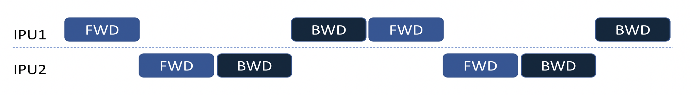
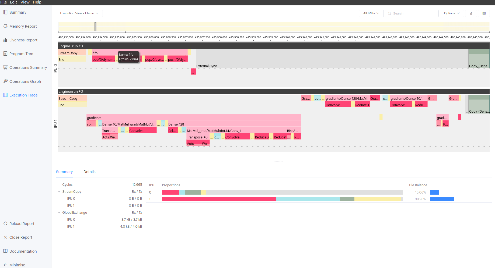
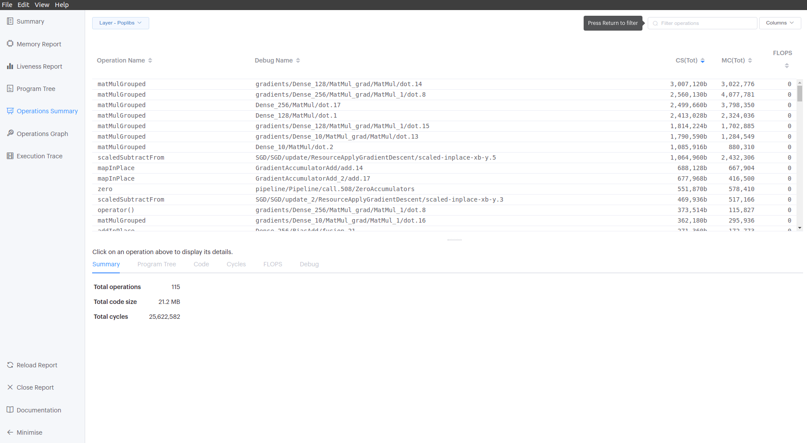

# TensorFlow 2: Pipelining and Tensor Inspection Techniques

In this tutorial you will train a selection of simple fully connected models
on the MNIST numeral data set and see how tensors (containing activations
and gradients) can be returned to the host via outfeeds for inspection.

Outfeeds can be useful for debugging, but can significantly increase the amount
of memory required on the IPU(s). When pipelining, you could use a smaller
value for the gradient accumulation count to mitigate this. Also consider using
a small number of steps per execution to reduce memory footprint. Filters can
be used to only return a subset of the activations and gradients.

## Required imports.
>**Note**
>The Graphcore TensorFlow 2 wheel is bundled with Graphcore Poplar SDK. Please
>ensure you install this wheel rather than the default public wheel, as it 
>contains IPU specific functionality in the `ipu` submodule.


```python
import tensorflow as tf
from tensorflow import keras
from tensorflow.python import ipu

from outfeed_callback import OutfeedCallback
from outfeed_optimizer import OutfeedOptimizer, OutfeedOptimizerMode
import outfeed_layers
from outfeed_wrapper import MaybeOutfeedQueue
```

## General approach to code in this tutorial

You will notice that a lot of code has been extracted to functions. This is 
mainly because when running in a Jupyter notebook most of the code has to be 
executed in the same Python context manager (which is scoped per cell). To 
avoid giant Jupyter notebook cells, you will only find invocations of functions
later once the Tensorflow IPU context has been used.

## Dataset preparation

We need to load the dataset and perform some normalization of values. Below
you will find a helper function to use inside IPU context, which will load
the input data with labels.


```python
def create_dataset():
    mnist = keras.datasets.mnist

    (x_train, y_train), (x_test, y_test) = mnist.load_data()
    x_train, x_test = x_train / 255.0, x_test / 255.0

    # Add a channels dimension.
    x_train = tf.expand_dims(x_train, -1)
    x_test = tf.expand_dims(x_test, -1)

    train_ds = tf.data.Dataset \
        .from_tensor_slices((x_train, y_train)) \
        .shuffle(len(x_train)) \
        .batch(32, drop_remainder=True)

    train_ds = train_ds.map(
        lambda d, l: (tf.cast(d, tf.float32), tf.cast(l, tf.float32))
    )
    return train_ds
```

## Pipelining features

In this tutorial, we will create models using the Keras Model class and IPU 
pipelining features.
We are going to use Pipeline Stages to assign operations to devices and to
configure parallelism. Additionally, we will use the functionality of outfeed
queues for IPUs to outfeed the activations for multiple layers for a specific
stage.
If you're interested you can read more about outfeed queues [here](https://docs.graphcore.ai/projects/tensorflow-user-guide/en/latest/perf_training.html#accessing-outfeed-queue-results-during-execution)

In the following graphics, FWD and BWD refer to forward and backward passes.

The computational stages can be interleaved on the devices in three different 
ways as described by the `pipeline_schedule` parameter. By default the API 
will use the `PipelineSchedule.Grouped` mode, where the forward passes are 
grouped together, and the backward passes are grouped together. 


The main alternative is the `PipelineSchedule.Interleaved` mode, where the 
forward and backward passes are interleaved, so that fewer activations need 
to be stored. 


Additionally, the `PipelineSchedule.Sequential` mode, where the pipeline is 
scheduled in the same way as if it were a sharded model, may be useful when 
debugging your model.


## File structure and local imports

* `mnist.py` The main Python script.
* `outfeed_callback.py` Contains a custom callback that dequeues an outfeed 
  queue at the end of every epoch.
* `outfeed_layers.py` Custom layers that (selectively) add the inputs 
  (for example, activations from the previous layer) to a dict that will be 
  enqueued on an outfeed queue.
* `outfeed_optimizer.py` Custom optimizer that outfeeds the gradients generated
  by a wrapped optimizer.
* `outfeed_wrapper.py` Contains the `MaybeOutfeedQueue` class, see below.
* `README.md` Markdown autogenerated file.
* `requirements.txt` Required packages for this tutorial

## Custom classes descriptions

This tutorial uses the following classes, which are implemented in libraries:

* `outfeed_wrapper.MaybeOutfeedQueue` - a wrapper for an IPUOutfeedQueue that 
  allows key-value pairs to be selectively added to a dictionary that can then 
  be enqueued.
* `outfeed_optimizer.OutfeedOptimizer` - a custom optimizer that enqueues 
  gradients using a `MaybeOutfeedQueue`, with the choice of whether to enqueue 
  the gradients after they are computed (the pre-accumulated gradients) or 
  before they are applied (the accumulated gradients).
* `outfeed_layers.Outfeed` - a Keras layer that puts the inputs into 
  a dictionary and enqueues it on an IPUOutfeedQueue.
* `outfeed_layers.MaybeOutfeed` - a Keras layer that uses a MaybeOutfeedQueue 
  to selectively put the inputs into a dict and optionally enqueues the dict. 
  At the moment, this layer cannot be used with non-pipelined Sequential models.
* `outfeed_callback.OutfeedCallback` - a Keras callback to dequeue an outfeed
  queue at the end of every epoch, printing some statistics about the tensors.

## General description for used model

By default, the example runs a three layer fully connected model, pipelined 
over two IPUs. Gradients for one of the layers, and activations for two of 
the layers, are returned for inspection on the host. This can be changed using 
options.

For the single IPU models (Model and Sequential), gradients and activations are
returned for one layer.

>What follows next are helper functions which act as factories for instances
>of Keras models. After the section where they are defined, there is an option
>to **choose one of them** for further processing.

## Option 1 - Keras `Functional` model without pipelining

Create the model using the Keras Model class.
Outfeed the activations for a single layer.


```python
def create_model(
        activations_outfeed_queue,
        gradient_accumulation_steps_per_replica
):
    input_layer = keras.layers.Input(
        shape=(28, 28, 1),
        dtype=tf.float32,
        batch_size=32
    )
    x = keras.layers.Flatten()(input_layer)
    x = keras.layers.Dense(128, activation='relu', name="Dense_128")(x)

    # Outfeed the activations for a single layer:
    x = outfeed_layers.Outfeed(
        activations_outfeed_queue,
        name="Dense_128_acts")(x)

    x = keras.layers.Dense(10, activation='softmax',  name="Dense_10")(x)

    keras_model = keras.Model(input_layer, x)
    keras_model.set_gradient_accumulation_options(
        gradient_accumulation_steps_per_replica=
        gradient_accumulation_steps_per_replica
    )
    return keras_model
```

##  Option 2 - Keras `Functional` model with pipelining for two separate Stages
The usage of Pipeline Stages can be found here:
[pipelined training](https://docs.graphcore.ai/projects/tensorflow-user-guide/en/latest/perf_training.html#pipelined-training)

To pipeline a `Functional` model you are writing yourself, each layer call must
happen within the scope of an `ipu.keras.PipelineStage` context.
In the function below, we assign layers to two different stages.


```python
def create_pipeline_model(
        multi_activations_outfeed_queue,
        gradient_accumulation_steps_per_replica
):
    input_layer = keras.layers.Input(shape=(28, 28, 1),
                                     dtype=tf.float32,
                                     batch_size=32)

    with ipu.keras.PipelineStage(0):
        x = keras.layers.Flatten()(input_layer)
        x = keras.layers.Dense(256, activation='relu', name="Dense_256")(x)

    with ipu.keras.PipelineStage(1):
        x = keras.layers.Dense(128, activation='relu', name="Dense_128")(x)
        x = outfeed_layers.MaybeOutfeed(multi_activations_outfeed_queue,
                                        final_outfeed=False,
                                        name="Dense_128_acts")(x)
        x = keras.layers.Dense(10, activation='softmax',  name="Dense_10")(x)
        x = outfeed_layers.MaybeOutfeed(multi_activations_outfeed_queue,
                                        final_outfeed=True,
                                        name="Dense_10_acts")(x)
    model = keras.Model(input_layer, x)
    model.set_pipelining_options(gradient_accumulation_steps_per_replica=
                                 gradient_accumulation_steps_per_replica)
    return model
```

##  Option 3 - Keras `Sequential model` without pipelining

This function creates the model using the Keras `Sequential` class. This class
groups a linear stack of layers into a `tf.Keras.Model`. Then, `Sequential`
provides training and inference features on this model.
 
We outfeed the activations for a single layer.


```python
def create_sequential_model(
        activations_outfeed_queue,
        gradient_accumulation_steps_per_replica
):
    model = keras.Sequential([
        keras.layers.Flatten(),
        keras.layers.Dense(128, activation='relu', name="Dense_128"),
        outfeed_layers.Outfeed(activations_outfeed_queue, name="Dense_128_acts"),
        keras.layers.Dense(10, activation='softmax', name="Dense_10")
    ])
    model\
        .set_gradient_accumulation_options(
          gradient_accumulation_steps_per_replica=
          gradient_accumulation_steps_per_replica
        )
    return model
```

##  Option 4 - Keras `Sequential model` with pipelining

This function reate the model using the Keras Sequential class. We can pipeline
the model by assigning layers to stages through 
`set_pipeline_stage_assignment`. We outfeed the activations for multiple 
layers in the second stage.

Below you will see pipeline stage assignment like this:
`model.set_pipeline_stage_assignment([0, 0, 1, 1, 1, 1])`
which means that first two layers of `Sequential` model are assigned to
the first stage, and the remaining four layers to the second stage.


```python
def create_pipeline_sequential_model(
        multi_activations_outfeed_queue,
        gradient_accumulation_steps_per_replica
):
    model = keras.Sequential([
        keras.layers.Flatten(),
        keras.layers.Dense(256, activation='relu', name="Dense_256"),
        keras.layers.Dense(128, activation='relu', name="Dense_128"),
        outfeed_layers.MaybeOutfeed(multi_activations_outfeed_queue,
                                    final_outfeed=False,
                                    name="Dense_128_acts"),
        keras.layers.Dense(10, activation='softmax', name="Dense_10"),
        outfeed_layers.MaybeOutfeed(multi_activations_outfeed_queue,
                                    final_outfeed=True,
                                    name="Dense_10_acts")
    ])
    model.set_pipelining_options(
        gradient_accumulation_steps_per_replica=
        gradient_accumulation_steps_per_replica
    )
    model.set_pipeline_stage_assignment([0, 0, 1, 1, 1, 1])
    return model
```

## Configuring pipelining

Choose values for the following variables that hold parameters.
If you change them for experimentation, re-run all the cells below including
this one.


```python
# Model Type can be "Model" or "Sequential"
SEQUENTIAL_MODEL = "Sequential"
REGULAR_MODEL = "Model"
model_type = SEQUENTIAL_MODEL

# [boolean] Should IPU pipelining be disabled?
no_pipelining = False

# [boolean] Should gradient accumulation be enabled? It's always enabled
# for pipelined models.
use_gradient_accumulation = True

# [boolean] Should the code outfeed the pre-accumulated gradients, rather than
# accumulated gradients? Only makes a difference when using gradient
# accumulation, which is always the case when pipelining is enabled.
outfeed_pre_accumulated_gradients = False

# Number of steps to run per execution.
steps_per_execution = 500

# Number of epochs
epochs = 3

# [List] String values representing which gradients to add to the dictionary
# that is enqueued on the outfeed queue. Pass `[none]` to disable filtering.
gradients_filters = ['Dense_128']


# [List] Activation filters - strings representing which activations in the
# second `PipelineStage` to add to the dictionary that is enqueued on the
# outfeed queue. Pass `[none]` to disable filtering. Applicable only for
# pipelined models.
activations_filters = ['none']
```

Automatically set these parameters based on user input and configure the IPU
system.
Outfeed optimizer mode documentation can be found in [outfeed_optimizer](./outfeed_optimizer.py)


```python
if no_pipelining:
    num_ipus = 1
else:
    num_ipus = 2
    use_gradient_accumulation = True

gradient_accumulation_steps_per_replica = 4

if outfeed_pre_accumulated_gradients:
    outfeed_optimizer_mode = OutfeedOptimizerMode.AFTER_COMPUTE
else:
    outfeed_optimizer_mode = OutfeedOptimizerMode.BEFORE_APPLY
```

Define a helper function to parse user input for filters:


```python
def process_filters(filters_input):
    if len(filters_input) == 1 and filters_input[0].lower() == "none":
        return None
    return filters_input
```

Define a helper function to use user selected values and inject a model into
an IPU-aware context where it's invoked:


```python
def instantiate_selected_model_type(
        gradient_accumulation_steps_per_replica,
        no_pipelining,
        use_gradient_accumulation,
        model_type,
        gradients_filters,
        activations_filters
):
    # Create the outfeed queue for selected gradients.
    # Remove the filters to get the gradients for all layers or pass different
    # strings to the argument to select other layer(s)
    optimizer_q = MaybeOutfeedQueue(filters=process_filters(gradients_filters))

    # Create a callback for the gradients.
    gradients_cb = OutfeedCallback(optimizer_q, name="Gradients callback")

    # Create callbacks for the activations in the custom layers.
    activations_q = ipu.ipu_outfeed_queue.IPUOutfeedQueue()
    layer_cb = OutfeedCallback(activations_q,
                               name="Single layer activations callback")

    multi_activations_q = MaybeOutfeedQueue(filters=process_filters(
                                                      activations_filters))
    multi_layer_cb = OutfeedCallback(multi_activations_q,
                                     name="Multi-layer activations callback")

    callbacks = [gradients_cb]

    model = None
    if not no_pipelining:
        if model_type == REGULAR_MODEL:
            model = create_pipeline_model(
                multi_activations_q, gradient_accumulation_steps_per_replica
            )
        elif model_type == SEQUENTIAL_MODEL:
            model = create_pipeline_sequential_model(
                multi_activations_q, gradient_accumulation_steps_per_replica
            )
        callbacks += [multi_layer_cb]
    else:
        if not use_gradient_accumulation:
            gradient_accumulation_steps_per_replica = 1

        if model_type == SEQUENTIAL_MODEL:
            model = create_sequential_model(
                activations_q, gradient_accumulation_steps_per_replica
            )
        elif model_type == REGULAR_MODEL:
            model = create_model(activations_q,
                                 gradient_accumulation_steps_per_replica)
        callbacks += [layer_cb]

    if not model:
        raise Exception("Please select proper model_type!")

    return model, callbacks, optimizer_q
```

Initialise IPU configuration - more details here [`IPUConfig`](https://docs.graphcore.ai/projects/tensorflow-user-guide/en/latest/api.html#tensorflow.python.ipu.config.IPUConfig)


```python
cfg = ipu.config.IPUConfig()
cfg.auto_select_ipus = num_ipus
cfg.configure_ipu_system()
```

## Placing and training the model on IPU

If you are using Keras, you must instantiate your Keras model inside of 
the strategy scope, which is a Python context manager.
More details here: [`IPUStrategy`](https://docs.graphcore.ai/projects/tensorflow-user-guide/en/latest/targeting_tf2.html#ipustrategy)


```python
strategy = ipu.ipu_strategy.IPUStrategy()
```

Use the `strategy.scope()` context to ensure that everything within that 
context will be compiled for the IPU device. You should do this instead of 
using the `tf.device` context.

This tutorial uses queues for handling of outfeeds.


```python
with strategy.scope():
    model, callbacks, optimizer_outfeed_queue = \
        instantiate_selected_model_type(
            gradient_accumulation_steps_per_replica=
            gradient_accumulation_steps_per_replica,
            no_pipelining=no_pipelining,
            use_gradient_accumulation=use_gradient_accumulation,
            model_type=model_type,
            gradients_filters=gradients_filters,
            activations_filters=activations_filters
        )

    # Build the graph passing an OutfeedOptimizer to enqueue selected gradients
    model.compile(
        loss=keras.losses.SparseCategoricalCrossentropy(),
        optimizer=OutfeedOptimizer(
            wrapped_optimizer=keras.optimizers.SGD(),
            outfeed_queue=optimizer_outfeed_queue,
            outfeed_optimizer_mode=outfeed_optimizer_mode,
            model=model
        ),
        steps_per_execution=steps_per_execution
    )

    # Train the model passing the callbacks to see the gradients
    # and activations stats
    model.fit(
        create_dataset(),
        callbacks=callbacks,
        steps_per_epoch=steps_per_execution,
        epochs=epochs
    )
```

Example callback outfeed print would look a bit like this:
```
Gradients callback
key: Dense_128/bias:0_grad shape: (125, 128)
key: Dense_128/kernel:0_grad shape: (125, 256, 128)
Epoch 3 - Summary Stats
Index Name                         Mean         Std          Minimum      Maximum      NaNs    infs   
0     Dense_128/bias:0_grad        -0.000663    0.021037     -0.108830    0.111534     False   False  
1     Dense_128/kernel:0_grad      -0.000120    0.012575     -0.186476    0.183576     False   False  

Single layer activations callback
No data enqueued
```

## Profiling and Visualising for pipelining

If you execute this code with environmental variable:
```bash
POPLAR_ENGINE_OPTIONS='{"autoReport.all":"true"}'
```

For example like this:
```bash
POPLAR_ENGINE_OPTIONS='{"autoReport.all":"true"}' python3 mnist.py
```

Or set this variable inside Jupyter Notebook:
```python
import os
os.environ['POPLAR_ENGINE_OPTIONS']='{"autoReport.all":"true"}'
```

Then you could use the generated report, which for this tutorial might look
like this:
```bash
ls .
```
> ./tf_report__2021-10-06__02-24-24.631__70052:
> archive.a
> debug.cbor
> framework.json
> profile.pop
> profile.pop_cache

## PopVision - reading the reports

When you open such a report, you could navigate to multiple reports.
Here you can see example views generated for a set of parameters in this
tutorial: pipelining enabled, for 2 IPUs with gradient accumulation enabled.



Also when you go to the Operations Summary and in the top left corner you 
select Tensorflow Layer, you can observe that SGD and gradient accumulation
was performed.

