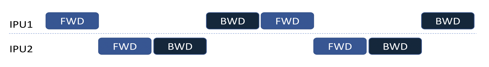

# TensorFlow 2: Model Parallelism with IPU Pipelining

In this tutorial you will train a selection of simple fully connected models
on the MNIST numeral data set and see how training can be parallelised over
multiple IPU devices.

## Upgrading to TensorFlow 2

Considering that IPU computation can be enabled on both TensorFlow 1 
and Tensorflow 2 it is necessary to explain the major differences between them
and how it affects implementation of IPU specific code.

### Device scopes
In IPU APIs for TF2, the scope context `ipu.scopes.ipu_scope(device_id)` was
replaced with a strategy context `ipu.ipu_strategy.IPUStrategy().scope().

### Training loop
Since TF2 moved in the direction of eager execution, we no longer are required
to create sessions and use them as context (`with tf.Session()...`). Instead, 
when using the Keras API, we can use the model instance directly and invoke
`model.compile()`, `model.fit()`, and `model.predict()` methods without
specifing explicitly the training loop. To enable IPUs, it is just required
that these invocations are executed under `IPUStrategy` scope.

### Keras extensions to facilitate IPU computing
You can find the main documentation on the [GraphCore Keras for IPU](https://docs.graphcore.ai/projects/tensorflow-user-guide/en/latest/keras_tf2.html) page.
The framework has been extended to enable IPU devices usage and configuration.
All the new code can be found within the `tensorflow.python.ipu` package.

### TF2 specific changes
There is a guide prepared by the TensorFlow team to conduct migration between
versions of TensorFlow library, which you can study [here](https://www.tensorflow.org/guide/migrate).

A very exhaustive comparison of both versions can be found [here](https://www.tensorflow.org/guide/migrate/tf1_vs_tf2).

## Pipelining features
In this tutorial, we will create models using the Keras Model class and IPU 
pipelining features.

We are going to use Pipeline Stages to assign operations to devices and to
configure parallelism.

In the following graphics, FWD and BWD refer to forward and backward passes.

The computational stages can be interleaved on the devices in three different 
ways as described by the `pipeline_schedule` parameter. By default the API 
will use the `PipelineSchedule.Grouped` mode, where the forward passes are 
grouped together, and the backward passes are grouped together. 


The main alternative is the `PipelineSchedule.Interleaved` mode, where the 
forward and backward passes are interleaved, so that fewer activations need 
to be stored. 


Additionally, the `PipelineSchedule.Sequential` mode, where the pipeline is 
scheduled in the same way as if it were a sharded model, may be useful when 
debugging your model.


This cell contains the constants applied to the whole tutorial. When modifying
these, make sure all the cells below are re-run (including this one).


```python
# Number of samples per batch.
BATCH_SIZE = 32

# Number of steps to run per execution. The number of batches to run for
# each TensorFlow function call. At most it would execute a full epoch.
STEPS_PER_EXECUTION = 500

# Number of steps per epoch. The total number of steps (batches of samples)
# for one epoch to finish and starting the next one. The default `None` is
# equal to the number of samples divided by the batch size.
STEPS_PER_EPOCH = STEPS_PER_EXECUTION

# Number of epochs
EPOCHS = 4

# Optimizer parameters.
LEARNING_RATE = 0.01
MOMENTUM = 0.9

# Number of devices that will be attached to this model for training and
# inference.
NUM_IPUS = 2

# Number of steps for which the gradients should be accumulated, for each
# configured replica.
STEPS_PER_REPLICA = 4
```

## Importing libraries


```python
from typing import Optional

import tensorflow as tf
from tensorflow import keras
from tensorflow.python import ipu
from tensorflow.keras import Model
from tensorflow.python.keras.engine.sequential import Sequential
from tensorflow.keras.layers import Flatten, Dense, Input
```

## Dataset preparation
We need to load the dataset and perform some normalization of values. Below
you will find a helper function to use inside IPU context, which will load
the input data with labels.


```python
def create_dataset(batch_size: int, repeat=True):
    mnist = keras.datasets.mnist
    (x_train, y_train), (x_test, y_test) = mnist.load_data()
    x_train, x_test = x_train / 255.0, x_test / 255.0

    train_ds = tf.data.Dataset.from_tensor_slices((x_train, y_train))
    train_ds = train_ds.shuffle(10000).batch(batch_size, drop_remainder=True)
    train_ds = train_ds.map(
        lambda d, l: (tf.cast(d, tf.float32), tf.cast(l, tf.float32))
    )
    if repeat:
        return train_ds.repeat()
    else:
        return train_ds


train_ds = create_dataset(batch_size=BATCH_SIZE)
```

Initialise IPU configuration - more details here [`IPUConfig`](https://docs.graphcore.ai/projects/tensorflow-user-guide/en/latest/api.html#tensorflow.python.ipu.config.IPUConfig).


```python
def make_ipu_config(
        num_ipus: int,
        selection_order: Optional[ipu.utils.SelectionOrder] = None
) -> ipu.config.IPUConfig:

    ipu_configuration = ipu.config.IPUConfig()
    ipu_configuration.auto_select_ipus = num_ipus

    if selection_order:
        ipu_configuration.selection_order = selection_order

    ipu_configuration.configure_ipu_system()
    return ipu_configuration
```

This will be the training function reused by all the kinds of models and modes
of pipelining.
> Note: model creation needs to be processed under the `IPUStrategy().scope()`,
> hence this function accepts only the reference to the function which performs
> the model creation, not the model instance (as `model_factory` argument).


```python
def train(strategy,
          model_factory,
          train_ds,
          steps_per_replica: int = STEPS_PER_REPLICA,
          steps_per_execution: int = STEPS_PER_EXECUTION,
          steps_per_epoch: int = STEPS_PER_EPOCH,
          epochs: int = 4):

    with strategy.scope():
        model = model_factory()

        model.compile(
            loss=tf.keras.losses.SparseCategoricalCrossentropy(
                from_logits=True
            ),
            optimizer=tf.keras.optimizers.SGD(
                learning_rate=LEARNING_RATE,
                momentum=MOMENTUM
            ),
            steps_per_execution=steps_per_execution
        )

        if steps_per_replica:
            model.set_pipelining_options(
                gradient_accumulation_steps_per_replica=steps_per_replica
            )

        model.fit(train_ds, steps_per_epoch=steps_per_epoch, epochs=epochs)
```

## Training a Keras `Functional` model on a single IPU

Next let's define a function which returns a `Functional` Keras model. This
implementation looks very similar to a regular non-IPU Keras model definition.

### Define the model


```python
def create_functional_model(batch_size=BATCH_SIZE):
    input_layer = Input(
        shape=(28, 28, 1),
        dtype=tf.float32,
        batch_size=batch_size
    )
    x = Flatten(name='flatten')(input_layer)
    x = Dense(256, activation='relu', name="dense256")(x)
    x = Dense(128, activation='relu', name="dense128")(x)
    x = Dense(64, activation='relu', name="dense64")(x)
    x = Dense(32, activation='relu', name="dense32")(x)
    x = Dense(10, name="logits")(x)

    model = Model(
        inputs=input_layer,
        outputs=x,
        name="singleIPU"
    )
    return model
```

### Execute Training

It is essential to create a fresh instance of `IPUConfig` and `IPUStrategy`
before training.


```python
ipu_configuration = make_ipu_config(num_ipus=1)

train(
    strategy=ipu.ipu_strategy.IPUStrategy(),
    model_factory=create_functional_model,
    train_ds=train_ds
)
```

## Training a Keras `Sequential` model on a single IPU

Let us organize the same layers using the `Sequential` Keras model API.
This class groups a linear stack of layers into a `tf.Keras.Model`. 
Then, `Sequential` provides training and inference features on this model.

### Define the model


```python
def create_sequential_model():
    seq_model = Sequential(
        layers=[
            Flatten(name='flatten'),
            Dense(256, activation='relu', name="dense256"),
            Dense(128, activation='relu', name="dense128"),
            Dense(64, activation='relu', name="dense64"),
            Dense(32, activation='relu', name="dense32"),
            Dense(10, activation='softmax', name="logits")
        ],
        name="singleIPU"
    )
    return seq_model
```

### Execute Training

Next we refresh IPU device configuration and train again with the new model.


```python
ipu_configuration = make_ipu_config(num_ipus=1)

train(
    strategy=ipu.ipu_strategy.IPUStrategy(),
    model_factory=create_sequential_model,
    train_ds=train_ds
)
```

##  Training a Keras `Functional` model with pipelining for two devices

The documentation of Pipeline Stages can be found [here](https://docs.graphcore.ai/projects/tensorflow-user-guide/en/latest/perf_training.html#pipelined-training).
There are two ways to enable IPU pipelining for a Keras model, depending on
if the user is writing a new model or using an existing model.

To pipeline a `Functional` model you are writing yourself, each layer call must
happen within the scope of an `ipu.keras.PipelineStage` context.
In the function below, we assign layers to two different stages.

### Define the model


```python
def create_functional_model_with_stages():
    input_layer = Input(shape=(28, 28, 1),
                                     dtype=tf.float32,
                                     batch_size=BATCH_SIZE)
    with ipu.keras.PipelineStage(0):
        x = Flatten(name='flatten')(input_layer)
        x = Dense(256, activation='relu', name="dense256")(x)
        x = Dense(128, activation='relu', name="dense128")(x)
        x = Dense(64, activation='relu', name="dense64")(x)

    with ipu.keras.PipelineStage(1):
        x = Dense(32, activation='relu', name="dense32")(x)
        x = Dense(10, name="logits")(x)

    model = Model(inputs=input_layer,
                  outputs=x,
                  name="multipleIPUfunctional")
    return model
```

In case an existing `TensorFlow` model is imported, an additional API
is provided to facilitate managing Pipeline Stages assignments.

This feature is implemented with `model.get_pipeline_stage_assignment()`
and `model.set_pipeline_stage_assignment(assignments)` where `assignments` is
the result of calling `get_pipeline_stage_assignment`.
For an example with the ResNet50 please check this [documentation](https://docs.graphcore.ai/projects/tensorflow-user-guide/en/latest/keras_tf2.html#pipelining-an-existing-functional-model).

### Execute Training

Next we refresh IPU device configuration and train again with the new model.


```python
ipu_configuration = make_ipu_config(num_ipus=2)

train(
    strategy=ipu.ipu_strategy.IPUStrategy(),
    model_factory=create_functional_model_with_stages,
    train_ds=train_ds
)
```

##  Training a Keras `Sequential model` with pipelining

Next we will write a function to create the model using the Keras `Sequential`
class as we did above, but with explicit mapping of layers to stages through 
`set_pipeline_stage_assignment`, which accepts a list of integers as
a parameter. This function sets the pipeline stage assignment for all
the invocations of all the layers (excluding input layers) in the model
which is used to create a model-parallel execution when calling `fit()`,
`evaluate()` and `predict()`. 

>This pipelining stage assignment is ignored when using the `call()` function
>on this model.

Below you will see pipeline stage assignment like this: `[0, 0, 1, 1 1, 1])`. 
This means that first two layers of `Sequential` model are assigned to 
the first stage, and the remaining layers to the second stage.

This list has to be has to be of the same length as the total number
of invocations of all the layers in this model, excluding input layers.

### Define the model


```python
def create_pipeline_sequential_model():
    seq_model = Sequential(
        layers=[
            Flatten(name='flatten'),
            Dense(256, activation='relu', name="dense256"),
            Dense(128, activation='relu', name="dense128"),
            Dense(64, activation='relu', name="dense64"),
            Dense(32, activation='relu', name="dense32"),
            Dense(10, activation='softmax', name="logits")
        ],
        name="multipleIPUsequential"
    )
    seq_model.set_pipeline_stage_assignment([0, 0, 1, 1, 1, 1])

    return seq_model
```

### Execute Training

Next we refresh IPU device configuration and train again with the new model.


```python
ipu_configuration = make_ipu_config(num_ipus=2)

train(
    strategy=ipu.ipu_strategy.IPUStrategy(),
    model_factory=create_pipeline_sequential_model,
    train_ds=train_ds
)
```

## Showcasing the `PipelineSchedule` setting effects on training

Next we can reuse the previous example and apply different scheduling modes,
as mentioned at the top of this document. The modes can be characterized
in detail like so (quoting the docstring of `PipelineSchedule`):

- `Grouped`: This groups the forward passes on multiple IPUs. This requires
  more memory since activations need to be stored until the backward stages run
  together. However, since forward passes tend to be smaller than backward 
  passes, `Grouped` tends to improve the speed of the execution, as different 
  IPUs don't spend so much time waiting for each other.

- `Interleaved`: This schedules the backward passes whenever the forward passes
  have just generated some activations.  Consequently fewer activations are 
  required to be stored between the forward and backward pipeline stages, so 
  less memory is required.  However, since forward and backward stages tend to 
  be very different in terms of execution cycles, the overall performance 
  of the pipeline tends to be slower.

- `Sequential`: This is a debug mode, where the pipeline is scheduled in
  the same way as if it were a sharded model.

### Define the model

The mode `Grouped` was used in the previous example, as it is the default
setting. In this next example we will use the `Interleaved` mode.


```python
def create_pipeline_sequential_model_interleaved():
    seq_model = Sequential(
        layers=[
            Flatten(name='flatten'),
            Dense(256, activation='relu', name="dense256"),
            Dense(128, activation='relu', name="dense128"),
            Dense(64, activation='relu', name="dense64"),
            Dense(32, activation='relu', name="dense32"),
            Dense(10, activation='softmax', name="logits")
        ],
        name="multipleIPUsequential"
    )
    seq_model.set_pipeline_stage_assignment([0, 0, 1, 1, 1, 1])

    seq_model.set_pipelining_options(
        schedule=ipu.ops.pipelining_ops.PipelineSchedule.Interleaved
    )
    return seq_model
```

### Execute training


```python
ipu_configuration = make_ipu_config(num_ipus=2)

train(
    strategy=ipu.ipu_strategy.IPUStrategy(),
    model_factory=create_pipeline_sequential_model_interleaved,
    train_ds=train_ds
)
```
