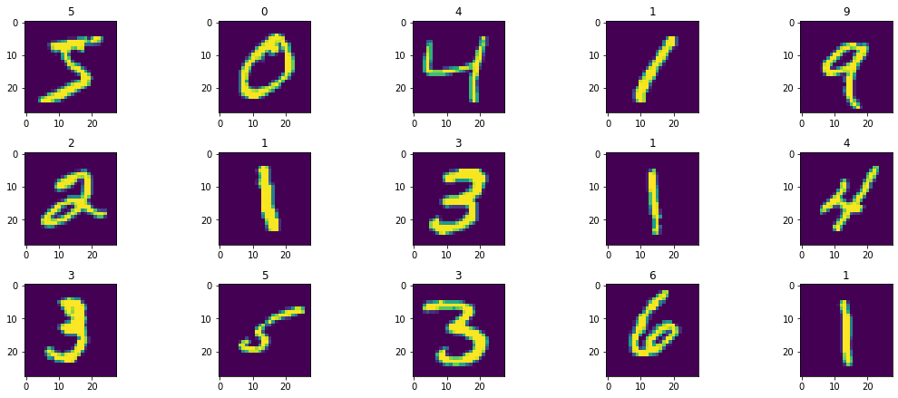

## Simple MNIST training example

This example presents how to train a simple 2-layer fully connected model on 
the MNIST numeral data set.

#### Prerequisites

Before we start the implementation, we need an environment with TensorFlow 
library that can be run on the IPU. To accomplish this, complete the following 
steps - install the Poplar SDK and Make sure to run the `enable.sh` script 
for Poplar and activate a Python virtualenv with the tensorflow-2 wheel from 
the Poplar SDK installed.

Let's validate the installation, import the libraries and check the tensorflow 
version:


```python
import tensorflow as tf
from matplotlib import pyplot as plt

from tensorflow import keras

from tensorflow.python import ipu

if tf.__version__[0] != '2':
    raise ImportError("TensorFlow 2 is required for this example")
```

#### Data loading

We are ready to start loading the data. In this tutorial, we take a look at 
the MNIST dataset. It contains b&w images (1 channel) of handwritten digits 0-9,
which have a size of 28 x 28 pixels. This dataset is available in the keras 
dataset repository.


```python
mnist = keras.datasets.mnist
(x_train, y_train), (x_test, y_test) = mnist.load_data()
x_train, x_test = x_train / 255.0, x_test / 255.0
```

Visualize part of our dataset:


```python
plt.figure(figsize=(15, 10))
for i, image, label in zip(range(15), x_train, y_train):
    ax = plt.subplot(5, 5, i + 1)
    ax.set_title(label)
    plt.imshow(image)
plt.tight_layout()
```


    

    


Create a tensorflow dataset:


```python
train_ds = tf.data.Dataset.from_tensor_slices((x_train, y_train))
train_ds = train_ds.shuffle(10000).batch(32, drop_remainder=True)
train_ds = train_ds.map(
    lambda d, l: (tf.cast(d, tf.float32), tf.cast(l, tf.float32))
)
train_ds = train_ds.repeat()
```

Now, we will create the model using standard Keras Sequential class. Important 
note, the creation of the Keras model must take place inside `strategy.scope` 
(we'll get to that later), in order to make this possible, we will wrap the 
model creation in a function:


```python
def create_model():
    model = keras.Sequential([
        keras.layers.Flatten(),
        keras.layers.Dense(128, activation='relu'),
        keras.layers.Dense(10, activation='softmax')])
    return model
```

#### IPU system configuration

Next, we should configure our IPU device. To do this, let's create an object 
of the `IPUConfig` class, and set the `auto_select_ipus = 1` variable - this 
means that a device with a single IPU will be automatically selected. Finally, 
we apply our settings using `configure_ipu_system` command.


```python
cfg = ipu.config.IPUConfig()
cfg.auto_select_ipus = 1
cfg.configure_ipu_system()
```

You can train, evaluate or run inference on single-IPU models through the Keras 
APIs as you would with other accelerators, as long as you create the model 
inside the scope of an `IPUStrategy`. In the following code, it is worth 
noting that the number of steps performed during an epoch must be divisible by 
the number of steps performed per execution.


```python
strategy = ipu.ipu_strategy.IPUStrategy()
with strategy.scope():
    model = create_model()
    model.compile(
        loss=keras.losses.SparseCategoricalCrossentropy(),
        optimizer=keras.optimizers.SGD(),
        steps_per_execution=100
    )
    model.fit(train_ds, steps_per_epoch=2000, epochs=4)
    
```

```
2000/2000 [==============================] - 11s 6ms/step - loss: 0.9795
 25%|███████████████████████████████████████                                                                                                                     | 1/4 [00:11<00:34, 11.50s/epoch, loss=0.637]Epoch 2/4
2000/2000 [==============================] - 1s 459us/step - loss: 0.3511
 50%|██████████████████████████████████████████████████████████████████████████████                                                                              | 2/4 [00:12<00:10,  5.27s/epoch, loss=0.333]Epoch 3/4
2000/2000 [==============================] - 1s 460us/step - loss: 0.2937
 75%|█████████████████████████████████████████████████████████████████████████████████████████████████████████████████████                                       | 3/4 [00:13<00:03,  3.29s/epoch, loss=0.283]Epoch 4/4
2000/2000 [==============================] - 1s 527us/step - loss: 0.2639
100%|████████████████████████████████████████████████████████████████████████████████████████████████████████████████████████████████████████████████████████████| 4/4 [00:14<00:00,  3.60s/epoch, loss=0.254]
```

If you would like to further explore the possibilities of using IPU with Keras, 
feel free to check [Keras with IPU's](https://docs.graphcore.ai/projects/tensorflow-user-guide/en/latest/keras_tf2.html#keras-with-ipus) 
documentation page.
